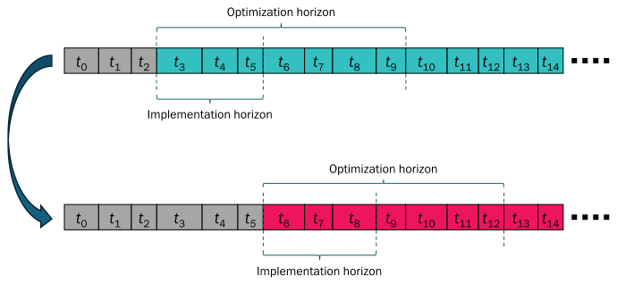

# [Philosophy](@id man-phil)

## [What is a receding horizon?](@id man-phil-rechor)

Receding horizon refers to a method for solving dynamic optimization problems where smaller dynamic optimization problems are solved repeatedly over changing horizons, which are updated based on previous solutions and new observations.
It is inspired by *model predictive control* (MPC), also known as receding horizon control [mattingley2011receding](@cite), where a control problem is defined by a dynamic optimization problem.
This problem is solved for a finite time horizon, the first calculated control action is implemented in the system, and a new dynamic optimization problem is formulated based on the new state of the system after implementing the control actions.

Here, we use the receding horizon concept to reduce the complexity of a full-scale optimization problem into smaller subproblems.
Each subproblem is solved over a finite time horizon (here denoted *optimization horizon*).
The solution for this subproblem is stored for a usually smaller time horizon (here denoted *implementation horizon*), and the next subproblem is posed to begin at the end of this implementation horizon, see illustration below.
Note that the individual operational periods do not need to have the same length.

This package is an extension of the core EnergyModelsBase structure,
and therefore it follows the same principles of flexibility, extendability, and transparency
(see the *[EnergyModelsBase page](https://energymodelsx.github.io/EnergyModelsBase.jl/stable/manual/philosophy/#man-phil-gen)* on its philosophy).

## [Types of horizons](@id man-phil-hortyp)

This package is based on setting up optimization subproblems given implementation and optimization horizons, as described above.
How these horizons are defined and updated will dictate the behavior of the receding horizon solver.
The behavior of these horizons is considered as an abstract type [`AbstractHorizons`](@ref EMRH.AbstractHorizons), allowing for common treatment of these approaches.
Two horizon types are provided with `EnergyModelsRecedingHorizon`, as subtypes of [`AbstractHorizons`](@ref EMRH.AbstractHorizons):

- [`PeriodHorizons`](@ref): the original time structure is partitioned according to the number of operational periods.
  This means that each implementation and optimization horizons are of the same length across the optimization subproblems.

- [`DurationHorizons`](@ref): the original time structure is partitioned according to the duration of the operational periods.
  This means that each implementation and optimization horizons may have varying length across the optimization subproblems.
  Because the model processes an integer number of operational periods at any given iteration, the duration of each implementation and optimization horizon may be slightly bigger than pre-defined.

## [Functionalities for receding horizon optimization](@id man-phil-func)

To solve optimization problems in a receding horizon framework, additional functionalities must be present in the problem.
These functionalities are implemented and are compatible with elements introduced in [`EnergyModelsBase`](https://energymodelsx.github.io/EnergyModelsBase.jl) and [`EnergyModelsGeography`](https://github.com/EnergyModelsX/EnergyModelsGeography.jl).

### [Initialization of elements](@id man-phil-func-init)

As the optimization horizon moves forward in the receding horizon iterations, the initial states of the model must be updated.
This is especially relevant for dynamic elements such as [`Storage`](@extref EnergyModelsBase.Storage) nodes, where the state at a given time depends on previous operation.
The basic functionality is implemented through [`InitData`](@ref) objects.
With it, one can define the value of the related model variables at the start of the current optimization horizon.
These functionalities can be extended through additional subtypes of [`AbstractInitData`](@ref).

For more implementation details, see the developer notes section on *[initialization](@ref dev-init)*.

### [Future value descriptions](@id man-phil-func-fv)

In some cases, it is necessary to use future value descriptions for dynamic states in receding horizon optimization.
This is done to obtain solutions for the smaller problems that are compatible with the full-horizon behavior.
The package provides two future value description.
The first description ([`StorageValueCuts`](@ref)) is based on the concept of storage end values [Aaslid2021](@cite), which introduces penalties related to the value of the outgoing state at the end of each individual optimization problem.
The second description ([`TypeFutureValue`](@ref)) assigns a cost contribution to the value of (a) variable(s) at the end of the implementation horizon for all instances of a type.

For a detailed description of this feature, refer to the section on the *[Implementation of future values](@ref man-fv)*.
The implementation is furthermore explained in the *[development notes](@ref dev-fv)*

## [When should you use the package?](@id man-phil-when)

The package is intended for use in complex optimization problems in which it is not feasible to model a complete operational horizon in a single optimization run.
In these problems, the solution of smaller problems sequentially in time may allow tractability of the problem.

The package is implemented with focus on calculating supply-demand balances for systems in an operational time scale and does not support investment analysis.
In addition, the calculation of operational costs for full periods is not yet implemented, although these can be calculated with the existing information.
